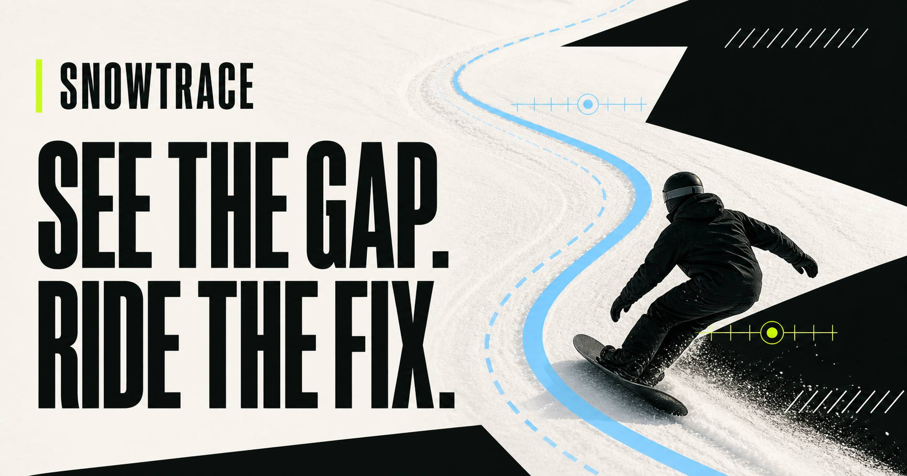
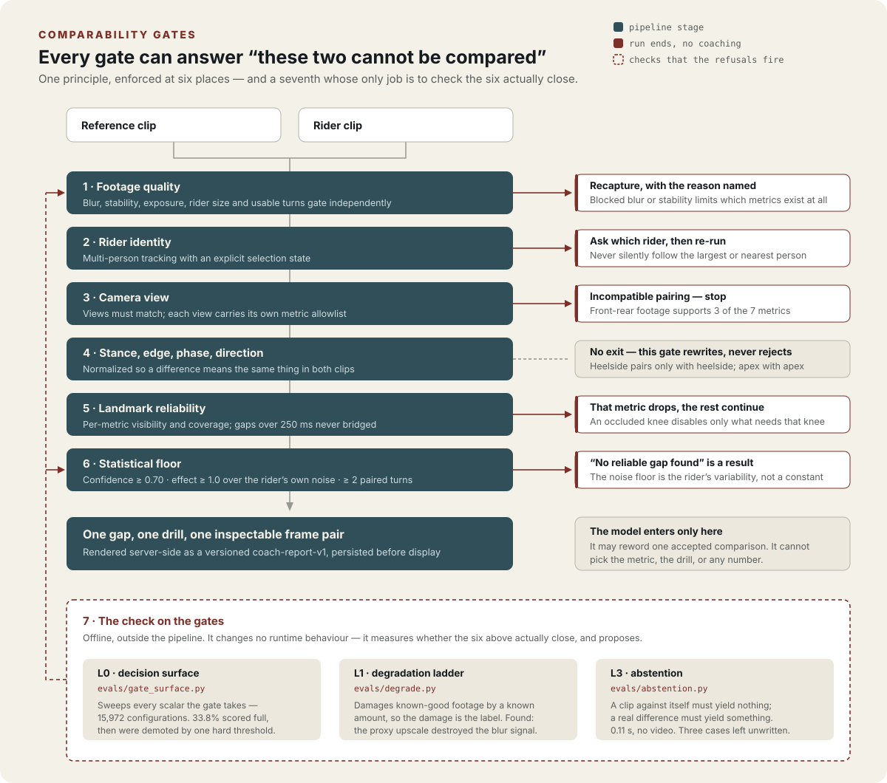

<p align="center">
  
</p>

<p align="center">
  <a href="https://snowtrace-coach.sjysjy.chatgpt.site"><strong>Open Snowtrace</strong></a>
  · <a href="./docs/BETA_RUNBOOK.md">Beta runbook</a>
  · <a href="./docs/ANALYSIS_DEPLOYMENT.md">Deploy the analyzer</a>
</p>

<p align="center"><strong>English</strong> · <a href="./README.zh-CN.md">中文</a></p>

# Snowtrace

Snowtrace is a confidence-first snowboard carving coach. A rider uploads one
reference clip and one clip of their own riding; the system checks whether the
footage is usable, aligns comparable turn phases, finds one meaningful movement
gap, and returns one evidence-backed drill.

This repository contains the first vertical slice, not a finished coaching
product. The web experience does not expose sample coaching: it checks worker
availability before upload and only shows evidence returned by the quality-gated
analysis service.

## What the system refuses to compare

<p align="center">
  
</p>

Almost every engineering decision in this repository comes from one rule: **two
measurements may be compared only when a difference between them means the same
thing in both clips.** Everything else follows, and most of what the code does
is refuse.

A coaching product fails in one direction that matters. It is not a missed
observation — a rider who gets no answer simply films again. It is a confident
instruction that is an artifact of the footage: the reference was shot from the
side and the rider from behind, the two riders ride opposite stances, the
compared turns were on opposite edges. Each of those produces a clean,
plausible, entirely wrong number. So every gate below is allowed to end the run,
and none of them is allowed to lower a confidence score and continue.

| Gate | Comparison is invalid when | What happens instead |
| --- | --- | --- |
| Footage quality | Blur, camera stability, exposure, rider size, or usable turn count fails independently | Recapture, with the specific failing check named. Blocked blur or stability limits which metrics can exist at all |
| Rider identity | More than one person is trackable and the subject is ambiguous | Analysis pauses and asks which rider, with representative-frame boxes, then re-runs on the selected track |
| Camera view | The two clips declare different views | The pairing is rejected. Each view also carries its own metric allowlist — front-rear footage supports three of the seven metrics, because 2D projection destroys the rest |
| Stance, edge, phase, direction | Lead/trail, heelside/toeside, turn phase, or screen travel direction are not aligned | This gate rewrites rather than rejects: metrics are normalized per clip so heelside pairs only with heelside and apex with apex |
| Landmark reliability | A required landmark is occluded, or a tracking gap exceeds 250 ms | Only the metrics depending on that landmark drop out. Long gaps are never bridged by interpolation into coaching evidence |
| Statistical floor | Confidence is under 0.70, effect size under 1.0 against the rider's own noise floor, or fewer than two paired turns | "No reliable gap found" is returned as a real result, not as a weak suggestion |

The language model sits after all six. It may reword one already-accepted
comparison; it cannot choose the metric, choose the drill, or introduce a
number. [`docs/LLM_COACHING_CONTRACT.md`](./docs/LLM_COACHING_CONTRACT.md) is
the enforced boundary, and the deterministic template in `lib/coaching.ts` stays
the production fallback even after the renderer is enabled.

[`docs/decisions.md`](./docs/decisions.md) gives the reasoning behind each of
these boundaries, the alternative that was rejected, and what the choice cost.

## What checks the gates

Six gates that refuse are worth only as much as the evidence that they actually
refuse, so `evals/` is a seventh layer whose only subject is the other six. It
runs offline, changes no runtime behaviour, and measures rather than redesigns.

- `evals/gate_surface.py` sweeps every scalar the quality gate accepts and
  reports where the verdict flips. Across 15,972 configurations, 33.8% scored
  high enough for a `full` verdict and were demoted to `limited` by a single
  hard threshold the rider-facing readiness number does not explain.
- `evals/degrade.py` damages known-good footage by a known amount, so the damage
  applied is the label. It found that the pipeline's own analysis proxy was
  destroying the sharpness signal the gate then scored — the system was judging
  footage it had itself degraded, and blaming the rider's filming for it.
- `evals/abstention.py` guards the outcome that matters most: a clip compared
  against itself must produce no coaching gap, and a plainly real difference
  must produce one. Either check alone is satisfied by a component that always
  says nothing. It runs in 0.11 s with no video, no MediaPipe, and no FFmpeg.

Three of the four abstention cases in the design are deliberately unwritten.
They need footage that does not exist yet or a live job queue, and written
against mocks they would test the mocks.

## What is built

- A mobile-first web flow from goal through reference clip, rider clip, filming
  context, quality checks, processing, and a one-gap report with inspectable
  Show Me evidence
- Browser-side pre-upload checks for duration, resolution, orientation,
  exposure, and clarity, so an unusable clip fails before it is uploaded
- Worker-side media normalization honoring phone display rotation, converting
  fixed and variable frame rate to zero-based CFR 30 fps, with runtime rejection
  of timebase drift beyond one frame
- An independent Python analysis service on FFmpeg, OpenCV, and the MediaPipe
  Pose Landmarker task model, deliberately replaceable
- Versioned `coach-report-v1` payloads built and persisted server-side, with
  idempotent terminal callbacks and a 12-minute lost-callback watchdog
- Session, video, track, turn, metric, evidence, report, drill, progression, and
  feedback tables in D1; R2 for source and proxy video, with authenticated
  retention cleanup
- A bearer-protected instructor review queue and a seven-day beta protocol with
  pre-committed KPI gates ([`docs/BETA_RUNBOOK.md`](./docs/BETA_RUNBOOK.md))

The MVP is snowboard carving only. It does not claim force, pressure, exact
board edge angle, or physically accurate 3D measurement, and it does not train a
custom vision model.

## Repository map

- `app/`: the Snowtrace web vertical slice
- `lib/analysis.ts`: shared browser-side analysis contracts and quality helpers
- `lib/coaching.ts`: shared deterministic report contract, validator, and
  confidence-safe fallback
- `analysis/`: the independent MediaPipe/FFmpeg analysis service and tests
- `evals/`: offline suite measuring whether the quality gate and the
  comparison layer actually refuse; needs no video for the abstention checks
- `docs/decisions.md`: why these boundaries and not others, with the cost of
  each choice stated
- `docs/LLM_COACHING_CONTRACT.md`: strict evidence-rendering boundary for a
  future Responses API integration
- `docs/BETA_RUNBOOK.md`: 20-rider protocol, independent review, KPI gates, and
  go/no-go rules
- `docs/ANALYSIS_DEPLOYMENT.md`: one-container worker deployment, secrets,
  Sites wiring, and production smoke test
- `db/schema.ts`: D1 application schema
- `drizzle/`: generated D1 migration
- `worker/`: Sites worker binding types
- `tests/`: rendered web-flow smoke tests

## Run the web app

Requires Node.js 22.13 or newer.

```bash
npm ci
npm run dev
```

Validation:

```bash
npm run lint
npm run typecheck
npm test
```

`npm test` produces the Sites-compatible build in `dist/`, verifies the
server-rendered entry experience, and exercises the full create → upload → queue
→ status → delete API lifecycle against local D1/R2-compatible test doubles.

## Run the analysis service

The service requires Python 3.11 or 3.12 and FFmpeg/ffprobe. The checked-in
MediaPipe task model is used by default.

```bash
python3.12 -m venv .venv
.venv/bin/pip install -e analysis
.venv/bin/uvicorn snowtrace_analysis.api:app --host 127.0.0.1 --port 8080
```

Validation:

```bash
.venv/bin/python -m unittest discover -s analysis/tests -v
```

The pair-analysis endpoint accepts short-lived HTTPS download URLs, optional
short-lived proxy upload URLs, per-video camera mode and stance, a shared
declared view, an explicit screen travel direction and first-complete-turn edge
label for each clip, and optional selected rider track IDs. Screen direction is
canonicalized only in metric coordinates; edge labels keep heelside turns
paired only with heelside turns and toeside turns paired only with toeside turns.
`SNOWTRACE_SOURCE_HOSTS` can restrict accepted source
hosts in production. `/v1/jobs` adds an authenticated asynchronous wrapper and
delivers the quality-gated result to an allowlisted HTTPS callback.

For one-off local analysis:

```bash
.venv/bin/snowtrace-analyze rider.mp4 --output result.json
```

For a zero-monthly-cost concierge beta, start the token-protected worker on
loopback with the checked-in launcher:

```bash
export SNOWTRACE_JOB_TOKEN='<analysis_service_token>'
./scripts/run-local-analysis.sh
```

The launcher refuses to start without a token, verifies FFmpeg, ffprobe, the
virtual environment, the MediaPipe model, and the requested port, limits the
worker to one active analysis, and deliberately disables local-file URLs. It
binds only to `127.0.0.1`; a tunnel is a separate, explicit deployment step.
See `docs/ANALYSIS_DEPLOYMENT.md` for the free local-beta runbook and its
availability limits.

Verify either localhost or the eventual HTTPS tunnel without sending a video
or exposing the service token:

```bash
npm run worker:check -- http://127.0.0.1:8080
npm run worker:check -- https://<worker-host>
```

## Deployment shape

The web UI is built with Vinext and deployed through Sites. `.openai/hosting.json`
declares:

- D1 binding: `DB`
- R2 binding: `VIDEOS`

The Python analysis service is deliberately independent so it can run in a
CPU-friendly container with FFmpeg and MediaPipe. The intended production
handoff is: browser → signed R2 upload → D1 analysis job → Python service → D1
report/evidence records → web report.

When `ANALYSIS_SERVICE_URL`, `ANALYSIS_SERVICE_TOKEN`, and
`ANALYSIS_SIGNING_SECRET` are configured in Sites, queueing a run dispatches it
to the Python service. Short-lived HMAC media grants let that service download
only the two videos attached to the run and upload 720p proxies. The callback
stores the raw versioned output plus ranked evidence; missing runtime secrets
leave the job honestly queued instead of fabricating a result.

The UI never exposes a sample coaching report. A completed job resolves to real
evidence, rider selection, an actionable recapture result, a no-reliable-gap
result, or a technical retry state.

The M0 web path currently uses streamed same-origin uploads capped at 95 MB per
clip so it remains below a common Worker request ceiling. Replace this transport
with direct multipart object-storage uploads before raising the size limit.

## Product guardrails

- A low-confidence clip is rejected or limited; it never produces confident
  coaching language.
- When identity is ambiguous, analysis pauses for rider selection instead of
  silently following the largest or nearest person.
- Every coaching claim must link to a phase and timestamp the rider can inspect.
- One report contains one primary gap and one drill, not a laundry list.
- Framework labels such as CASI, AASI, or JSBA are optional references rather
  than the source of truth.
- The UI never substitutes sample values when service evidence is unavailable.
